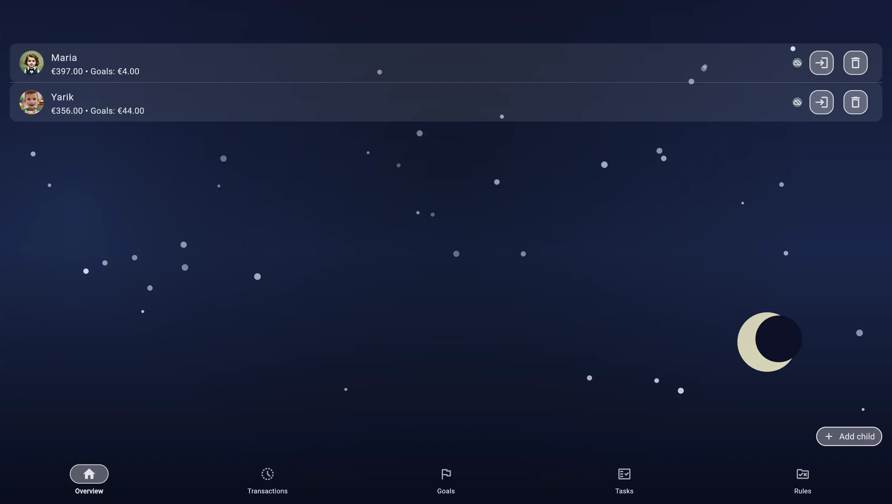
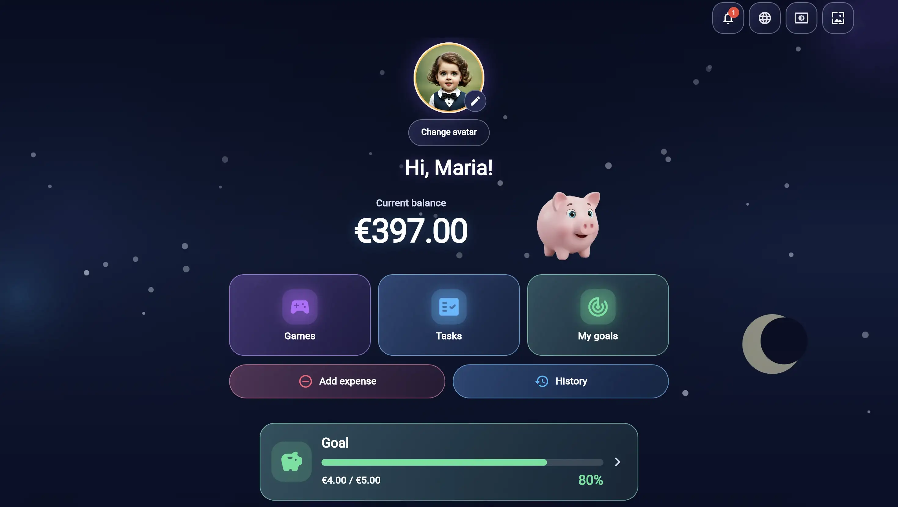
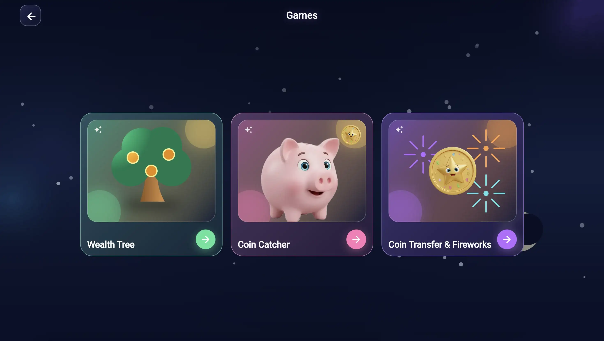
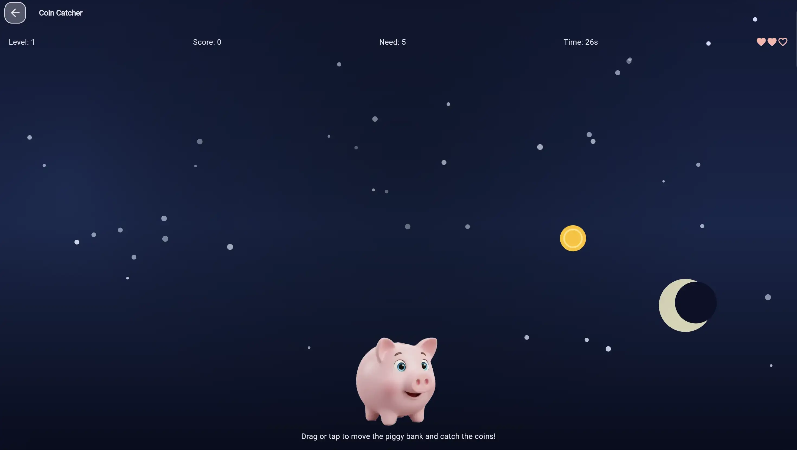
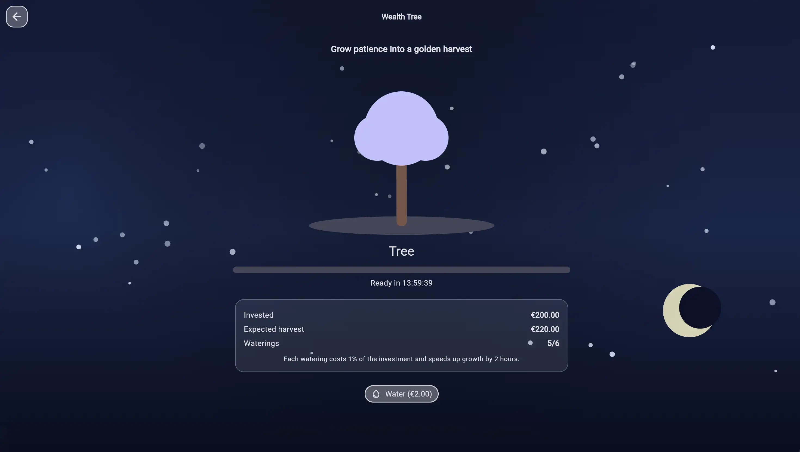

# Kids Piggy Bank — Case Study

Kids Piggy Bank is a production Flutter application for family financial education, available across mobile and web. It gives parents tools for managing children, balances, goals, tasks, and rules while giving children an age-appropriate space for learning through simple financial activities and games.

This repository is a portfolio case study. It documents the product architecture and publishes small, sanitized Dart examples; the complete application source remains private.

**Product:** <https://kids-piggybank.web.app/>

## Product surface

- Parent and child modes with separate navigation and interaction patterns.
- Balances, transactions, savings goals, tasks, rules, notifications, and family profiles.
- Child-oriented learning activities including Wealth Tree, Coin Catcher, and reward interactions.
- Responsive layouts for mobile and web, with keyboard and accessibility considerations.
- Firebase Authentication and Cloud Firestore integration.
- Android release delivery through Google Play closed testing and a validated Firebase Hosting build.

## Engineering focus

The project combines Flutter UI with a repository and state layer that keeps local interaction responsive while synchronizing owned data with Firestore. Parent and child flows are separated at the application and data-ownership boundaries. Monetary actions and game rewards are designed to remain consistent across retries, restarts, and synchronization events.

The web delivery pipeline assembles public educational pages with the authenticated application under `/app/`. It also validates the final artifact so the public web surface remains free of mobile advertising markers while mobile ad verification files remain available where required.

## Case-study contents

```text
docs/
  architecture.md       Runtime boundaries and data flow
  responsive-ui.md      Responsive layout and interaction decisions
  firebase.md           Authentication, Firestore, and ownership boundaries
  release.md            Mobile and web delivery workflow
screenshots/            Product captures with demo data
samples/
  responsive_layout_example.dart
  state_example.dart
```

Read the [architecture overview](docs/architecture.md) first, then the [responsive UI](docs/responsive-ui.md), [Firebase boundary](docs/firebase.md), and [release workflow](docs/release.md) notes.

## Screenshots

The screenshots use demonstration data and show representative product surfaces.

| Parent overview | Child dashboard |
| --- | --- |
|  |  |

| Games | Coin Catcher |
| --- | --- |
|  |  |

| Wealth Tree | Coin Transfer and Fireworks |
| --- | --- |
|  |  |

## Scope and privacy

The private application repository contains production implementation details that are not needed for portfolio review. They are intentionally excluded here, including Firebase configuration, environment files, signing material, deployment credentials, Firestore rule source, and the complete feature implementation.

The sample files are written as small illustrative examples around the same engineering concerns. They do not contain credentials, production identifiers, customer data, or a runnable copy of the application.

This case study and its samples are published for portfolio review. No reuse license is granted for the original application, screenshots, or product materials.
