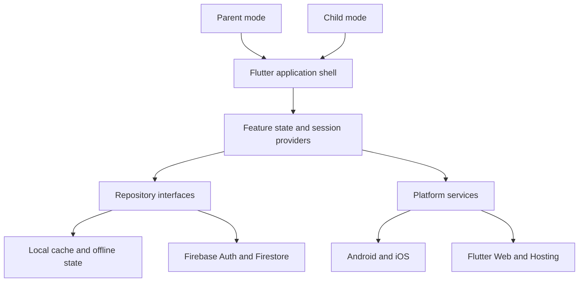

# Architecture overview

Kids Piggy Bank uses a Flutter client with separate UI, state, repository, and remote-data responsibilities. The boundaries keep product flows understandable while allowing local interaction, synchronization, and platform-specific services to evolve independently.

## Application shell

The shell owns authentication state, session transitions, navigation, responsive layout, and platform capabilities. Parent and child flows share common visual language but use different routes and interaction affordances.

## State and repositories

Feature providers expose view-ready state and coordinate loading, optimistic updates, retry behavior, and cleanup. Repository interfaces keep Firestore and local implementations behind the same application boundary. This allows tests to exercise business behavior without requiring a live Firebase project.

## Data ownership

Family data is associated with authenticated ownership and child-specific identities. Reads and writes pass through the repository boundary, while Firebase rules enforce the server-side access model. The public case study describes this boundary without reproducing the private schema or rules.

## Platform services

Authentication, secure storage, notifications, local device capabilities, in-app review, ads, and web hosting are isolated behind service adapters. The application can therefore select the correct implementation for Android, iOS, and Web without scattering platform checks through feature screens.

## Reliability priorities

The production implementation treats retries, offline hydration, duplicate events, and restart recovery as normal states. Transaction and reward operations are designed to preserve a single logical result even when a user repeats an action or a connection is interrupted.
